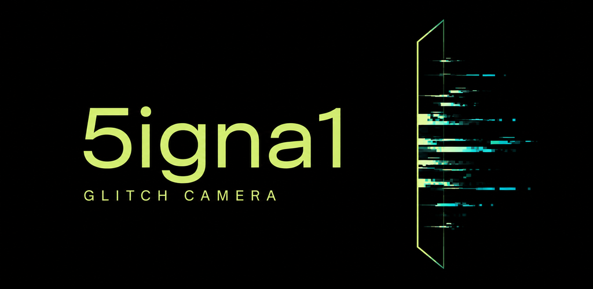

# 5igna1

**壊れた信号を、写真にする。**

Androidのためのグリッチカメラ。行のずれ、色の裂け、読み出しの欠落。撮る前の映像に手を入れ、その一瞬を写真や動画に残します。

[English](README.md) · [ダウンロード](https://github.com/Bongorian/5igna1-release/releases/latest) · [はじめての撮影](docs/GETTING_STARTED.ja.md) · [ガイド一覧](docs/README.ja.md)



[](https://github.com/Bongorian/5igna1-release/actions/workflows/android.yml)
[](LICENSE)


## 同じ壊れた系から、その瞬間を撮る

このソースは**1.2.0（versionCode 10）**です。初回起動時にオフラインのチュートリアルを表示し、設定から再表示できます。1.0.0からの更新時は新しいFAULTモデルに合わせて旧エフェクト設定を初期化し、保存済みの作品は保持します。

個体差は保持し、読み出しのdrift、露光位相、一時的な欠落が時間とともに変化します。選択した経路と個体を通常の時間進行で入れ替えません。実カメラ由来の信号だけを扱い、被写体の意味推論による生成・補完はしません。RAW／RGB／色差／媒体・表示後の信号は異なる表現であり、RAWだけを唯一の真とは扱いません。

| FAULT POINT | FAULT |
|---|---|
| SENSOR | PIXEL DAMAGE · EXPOSURE |
| READOUT | ROW ERROR |
| DATA | BIT ERROR · ADDRESS ERROR |
| CFA / RECONSTRUCTION | CFA ERROR · DEMOSAIC ERROR |
| COLOR | CHROMA ERROR · COLOR MAP |
| CODEC / STREAM | BLOCK ERROR · STREAM ERROR |
| MEDIA | VHS |
| DISPLAY | CRT |

CLEANはFAULTなし。各FAULTの少数の操作値から、固有の故障パラメータへ変換します。「ランダムチェーン」は組み合わせと操作値を生成し、長押しでは設定を保って故障個体だけを変えます。LIVEは今この瞬間のFAULTの時間進行・変化の形・秒単位の間隔と端末入力を設定します。一時停止・故障の発生・時間リセットを操作できます。ADVANCED MODEでは全FAULTの内部パラメータと時間・事故の生成値をAUTO／固定値で操作できます。VHS／CRTは媒体・表示特性と内部故障を区別します。STREAM ERRORは復号画像領域の欠落・再利用モデルで、実packetは破壊しません。

[FAULT一覧](docs/EFFECTS.ja.md) · [LIVE](docs/LIVE_FAULT.ja.md) · [ADVANCED MODE](docs/ADVANCED_MODE.ja.md) · [調査・移行設計](docs/design/FAULT_SYSTEM.ja.md)

## 最初の一枚

1. 写真モードで「JPEG · 表示した信号」を選びます。
2. ROW ERRORを選び、ずれと欠落を調整して適用します。同じ弱い行が時間とともに動く様子を観察します。
3. 気になった瞬間にシャッターを押し、サムネイルから保存画像を開きます。

JPEGは画面が受け取った画像を撮影操作時に確保し、後続フレームや設定変更で置き換わらないよう保存します。通常動画も同じ処理画像を使います。JPEGの解像度は対応ライブ信号の解像度です。RAWは別露光・別表現であり、RGB画面そのものではありません。[形式と制約](docs/FORMATS.ja.md)

次はCHROMA ERRORやVHSを加えてみてください。[撮影ガイド](docs/GETTING_STARTED.ja.md) · [表現の出発点](docs/RECIPES.ja.md)

## ダウンロードと更新

**Android 12以降**に対応。Camera2対応カメラとOpenGL ES 2.0が必要です。RAW、最大解像度、fpsは端末・カメラによって変わります。

### GitHub Releases / Obtainium

[最新版のRelease](https://github.com/Bongorian/5igna1-release/releases/latest)から `5igna1-vX.Y.Z.apk` をダウンロードします。ABI別の選択は不要です。初めてAPKを入れる場合は[インストール手順](docs/INSTALLATION.md)へ。

Obtainiumのアプリ追加に、次のURLを登録できます。

```text
https://github.com/Bongorian/5igna1-release
```

[更新・署名の確認](docs/INSTALLATION.md#updating) · [変更履歴](CHANGELOG.md)

### Google Play

1.0.0のクローズドテストを実施中です。2026-09-09に同じAlphaトラックへ1.1.0の更新を審査送信しました。正式公開後にストアリンクを掲載します。

### F-Droid

2026-09-08時点で1.0.0の提出はマージ待ちです（開発者報告）。公式リポジトリにはまだ掲載されていません。[提出準備の状況](docs/FDROID_READINESS.md)

Play / F-Droid / GitHub版で主要機能は共通です。配布元をまたぐ更新には署名の一致が必要です。

## 保存とプライバシー

| 出力 | 保存先 |
|---|---|
| JPEG・DNG写真 | `DCIM/5igna1` |
| MP4動画 | `DCIM/5igna1` |
| RAW動画のDNG連番ZIP（実験的） | `Download/5igna1` |

GPSは初期OFF、動画の録音は任意です。DNGには現像アプリが必要で、RAWプレビューと現像結果は同一にはなりません。

[形式の選び方](docs/FORMATS.ja.md) · [困ったとき](docs/TROUBLESHOOTING.md) · [プライバシーポリシー](docs/PRIVACY.ja.md)

## 仕組みを知る・一緒に作る

Camera2の入力を、プレビュー・JPEG・通常動画ではOpenGL ESの複数パスで加工します。加工DNGではRAW16の画素データに処理を適用します。ハードウェアを故障させる機能ではありません。

[内部設計](docs/ARCHITECTURE.md) · [RAWパイプライン](docs/raw-pipeline.md) · [検証済みの範囲](docs/VALIDATION.md)

JDK 17とAndroid SDK 36 / Build Tools 35.0.0でビルドできます。

```sh
./tools/build.sh
```

[ビルド手順](docs/building.md) · [開発への参加](CONTRIBUTING.md) · [不具合の報告](https://github.com/Bongorian/5igna1-release/issues)

## License

5igna1 by **Bongorian**。コード本体は[Apache License 2.0](LICENSE)です。[NOTICE](NOTICE)と[第三者ライセンス](THIRD_PARTY_LICENSES.md)をご確認ください。

開発版には端末に合わせた推奨設定と、プレビュー負荷の自動調整があります。[発熱・負荷対策](docs/PERFORMANCE.ja.md)。

設定の「モード」にADVANCEDとEXPERTをまとめています。ADVANCEDは内部値の表示、EXPERTはアプリの更新頻度制限・冷却休止を外して速度を優先するモードです。[動作モード](docs/PERFORMANCE.ja.md)。
