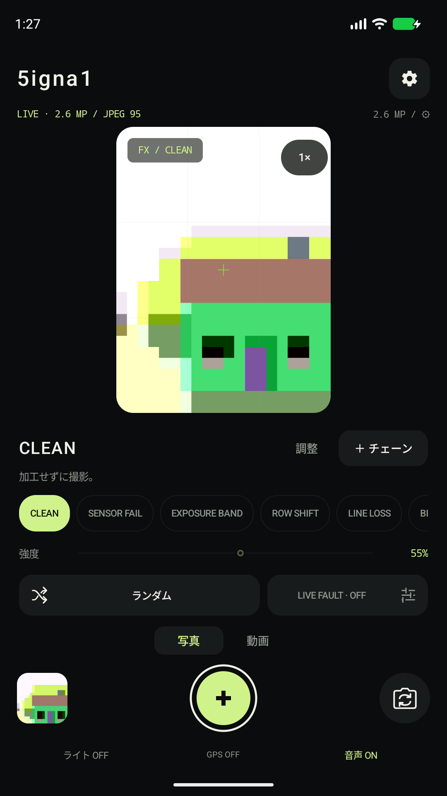
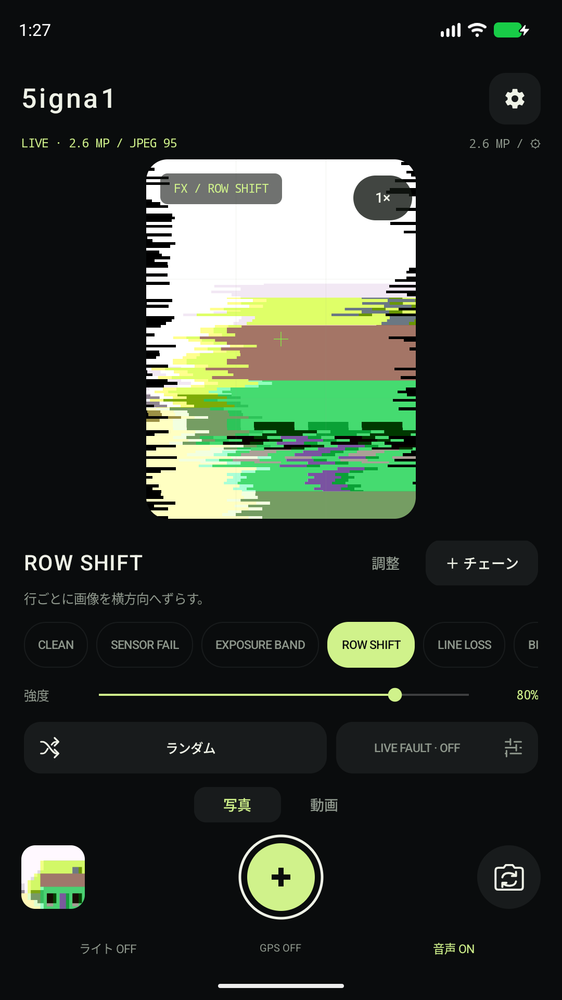
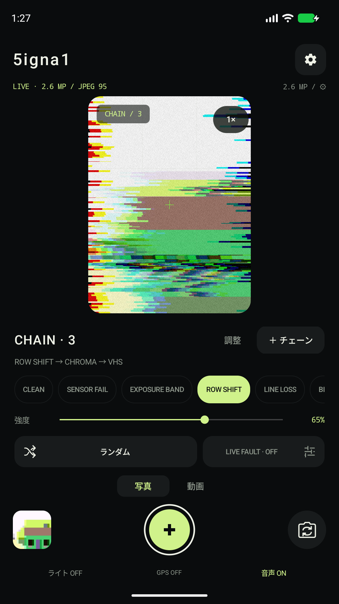

# 5igna1

**壊れた信号を、写真にする。**

Androidのためのグリッチカメラ。行のずれ、色の裂け、読み出しの欠落。撮る前の映像に手を入れ、その一瞬を写真や動画に残します。

[English](README.md) · [ダウンロード](https://github.com/Bongorian/5igna1-release/releases/latest) · [はじめての撮影](docs/GETTING_STARTED.ja.md) · [ガイド一覧](docs/README.ja.md)


[](https://github.com/Bongorian/5igna1-release/actions/workflows/android.yml)
[](LICENSE)


## 撮る前から、像を崩す

5igna1は、カメラの中で信号が画像になる過程を、表現の入口にした作品です。センサーから読み出し、色処理、表示まで。どこを崩すかを選び、ライブプレビューを見ながら強さを探れます。

- **一つの乱れから始める。** CLEANと16エフェクト。単体でも、処理順に重ねるチェーンでも。
- **変化する瞬間を撮る。** LIVE FAULTで強度やパラメータを自動変化させ、気になった瞬間を保存。
- **データまで触れる。** JPEG・MP4に加え、対応カメラではRAW原本と加工DNGを保存。

画像処理は端末内で完結します。広告・トラッキング・アカウント登録はありません。

## アプリの実画面

<table>
  <tr>
    <td></td>
    <td></td>
    <td></td>
  </tr>
  <tr><td>CLEAN / 加工前</td><td>ROW SHIFT / 行のずれ</td><td>CHAIN / 乱れを重ねる</td></tr>
</table>

Android Emulator上の実際のUIです。被写体はAOSPのテストパターン。上のタイトル画像は作品紹介用アートで、撮影サンプルとは別です。[素材の出典](docs/audit/ASSETS.md)

## 最初の一枚

1. **写真・加工JPEG**で始めます。カメラの使用を許可してください。
2. **ROW SHIFT**を選び、強度を動かしてプレビューの変化を見ます。「調整」で編集したら「適用」で確定します。
3. 中央の撮影ボタンで保存。左下のサムネイルから、できた写真を開けます。

次はCHROMAやVHSを重ねてみてください。[はじめての撮影](docs/GETTING_STARTED.ja.md)には操作を、[表現のレシピ](docs/RECIPES.ja.md)には組み合わせの出発点をまとめました。

## 表現の入口

| したいこと | 試すエフェクト |
|---|---|
| 形を横へ引きずる、行を抜く | ROW SHIFT · LINE LOSS |
| 色を裂く、色数や色の境界を変える | CHROMA · SPECTRUM · CHROMA LOSS |
| 点や帯、データの乱れを加える | SENSOR FAIL · EXPOSURE BAND · BIT ROT · DATA SHIFT |
| 色配列や補間の崩れを作る | CFA TEAR · CFA OFFSET · DEMOSAIC |
| ブロックや古い表示の揺らぎを重ねる | CORRUPT · PACKET LOSS · VHS · TERMINAL |

PACKET LOSSは動画専用です。加工RAWにはセンサー〜CFAの8効果を使えます。[全エフェクトと適用順](docs/EFFECTS.ja.md)

## ダウンロードと更新

**Android 12以降**に対応。Camera2対応カメラとOpenGL ES 2.0が必要です。RAW、最大解像度、fpsは端末・カメラによって変わります。

### GitHub Releases / Obtainium

[最新版のRelease](https://github.com/Bongorian/5igna1-release/releases/latest)から `5igna1-vX.Y.Z.apk` をダウンロードします。ABI別の選択は不要です。初めてAPKを入れる場合は[インストール手順](docs/INSTALLATION.md)へ。

Obtainiumのアプリ追加に、次のURLを登録できます。

```text
https://github.com/Bongorian/5igna1-release
```

[更新・署名の確認](docs/INSTALLATION.md#updating) · [変更履歴](CHANGELOG.md)

### Google Play

Developer登録中です。掲載後にここへ公式ストアURLを追加します。

### F-Droid

FOSS構成と提出用メタデータを用意しています。公式リポジトリへの掲載はこれからです。[提出準備の状況](docs/FDROID_READINESS.md)

Play / F-Droid / GitHub版で主要機能は共通です。配布元をまたぐ更新には署名の一致が必要です。

## 保存とプライバシー

| 出力 | 保存先 |
|---|---|
| JPEG・DNG写真 | `Pictures/5igna1` |
| MP4動画 | `Movies/5igna1` |
| RAW動画のDNG連番ZIP（実験的） | `Download/5igna1` |

GPSは初期OFF、動画の録音は任意です。DNGには現像アプリが必要で、RAWプレビューと現像結果は同一にはなりません。

[形式の選び方](docs/FORMATS.ja.md) · [困ったとき](docs/TROUBLESHOOTING.md) · [プライバシーポリシー](docs/PRIVACY.ja.md)

## 仕組みを知る・一緒に作る

Camera2の入力を、プレビュー・JPEG・通常動画ではOpenGL ESの複数パスで加工します。加工DNGではRAW16の画素データに処理を適用します。ハードウェアを故障させる機能ではありません。

[内部設計](docs/ARCHITECTURE.md) · [RAWパイプライン](docs/raw-pipeline.md) · [検証済みの範囲](docs/VALIDATION.md)

JDK 17とAndroid SDK 36 / Build Tools 35.0.0でビルドできます。

```sh
./tools/build.sh
```

[ビルド手順](docs/building.md) · [開発への参加](CONTRIBUTING.md) · [不具合の報告](https://github.com/Bongorian/5igna1-release/issues)

## License

5igna1 by **Bongorian**。コード本体は[Apache License 2.0](LICENSE)です。[NOTICE](NOTICE)と[第三者ライセンス](THIRD_PARTY_LICENSES.md)をご確認ください。
