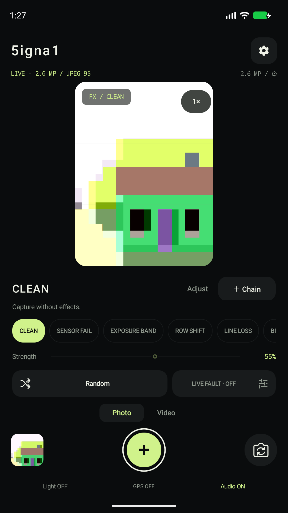
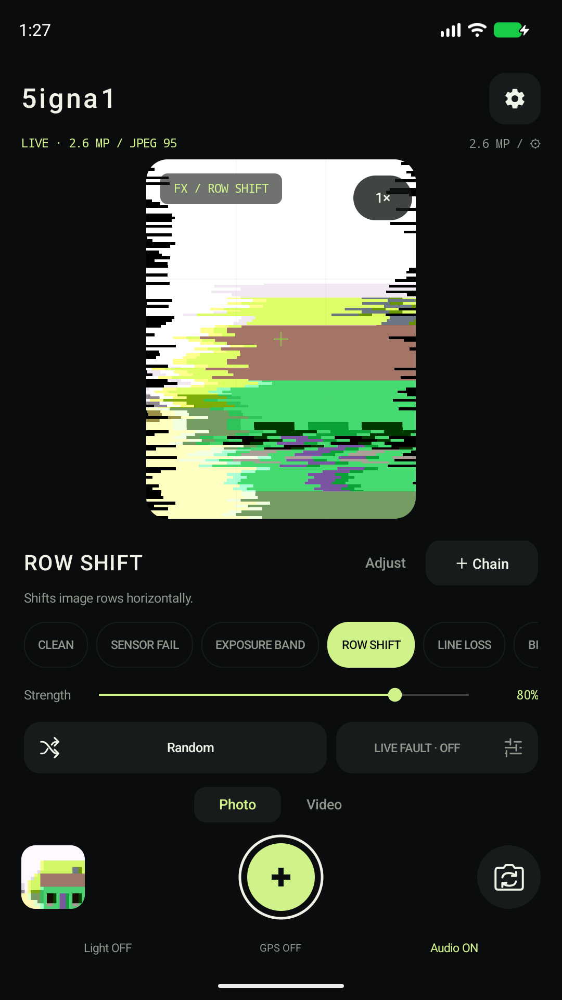
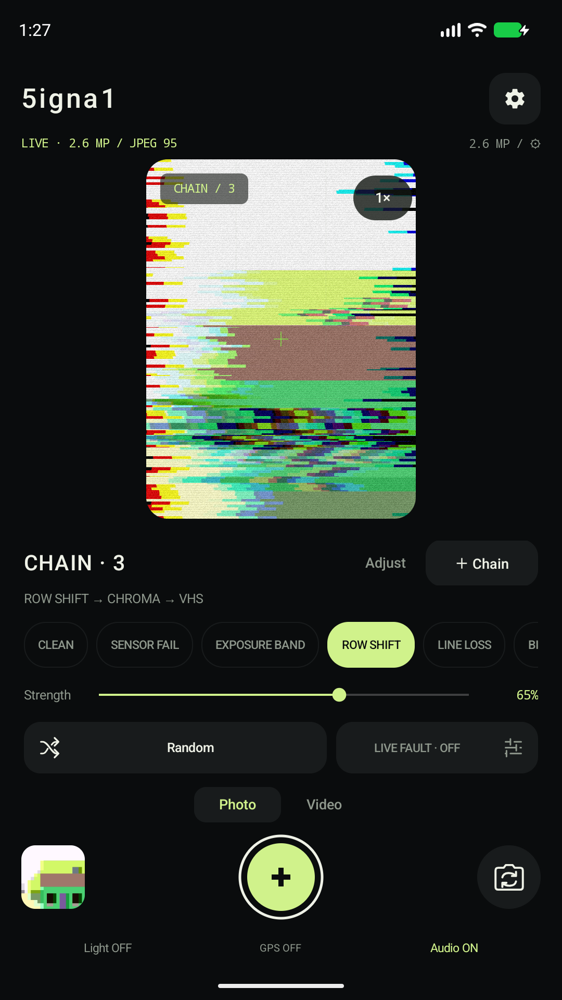

# 5igna1

**Every glitch is an encounter.**

A camera for finding images in a broken signal. Shift the readout. Tear the color array. Let a fault arrive, and photograph the moment it makes.

[Download](https://github.com/Bongorian/5igna1-release/releases/latest) · [Your first photograph](docs/GETTING_STARTED.md) · [The idea behind 5igna1](docs/ABOUT.md) · [日本語](README.ja.md)


[](https://github.com/Bongorian/5igna1-release/actions/workflows/android.yml)
[](LICENSE)


## One encounter, one moment

*Ichigo-ichie* — an encounter that belongs to its moment.

In 5igna1, the subject, the light, your movement, and the timing of a fault meet in the viewfinder. Some patterns hold their position. LIVE FAULT adds changing strength and parameters. The photograph is the moment you choose from that interaction.

You can keep a setting. You cannot keep the scene from moving on.

## Choose where the signal breaks

5igna1 takes its cues from the behavior of imaging failures: dropped lines, shifted readout data, damaged bits, mismatched color arrays, and unstable displays. Each effect has a place in the path from sensor to image.

The difference from a preset filter workflow is the question you ask. Rather than choosing a finished look, you choose **what goes wrong, where it happens, and how strongly it appears** — while the camera is running.

These are software interpretations. JPEG and video use GPU approximations; processed RAW changes sensor sample data directly. Some effects, such as SPECTRUM and TERMINAL, are deliberately stylized. 5igna1 does not damage the camera or claim to reproduce every physical fault exactly.

[Read the project statement](docs/ABOUT.md) · [Explore the effect models](docs/EFFECTS.md)

## An instrument for live images

- **CLEAN + 16 effects.** Use one fault or combine several in the order they occur along the imaging pipeline.
- **LIVE FAULT.** Let strength and parameters change over time, then capture an instant or record the change.
- **JPEG, MP4, and RAW.** Save a finished image, or work with original and processed DNG on supported cameras.
- **On your device.** No ads, tracking SDKs, or account registration. The app has no Internet permission.

Japanese, English, and Simplified Chinese are available in the app. All distribution flavors share the same core features.

## Through the viewfinder

<table>
  <tr>
    <td></td>
    <td></td>
    <td></td>
  </tr>
  <tr><td>CLEAN / Observe</td><td>ROW SHIFT / Displace</td><td>CHAIN / Combine</td></tr>
</table>

Actual app screens in Android Emulator, with an AOSP test pattern as the subject. The title graphic above is promotional artwork, not a sample photograph. [Asset provenance](docs/audit/ASSETS.md)

## Make your first photograph

1. Start in **Photo** mode with **processed JPEG**, and allow camera access.
2. Select **ROW SHIFT**. Move the strength control and watch the outline of your subject. Confirm any edits with **Apply**.
3. Press the center capture button. Open the saved image from the bottom-left thumbnail.

Next, try adding CHROMA or VHS. [Get started](docs/GETTING_STARTED.md), or follow a [creative recipe](docs/RECIPES.md).

## A vocabulary of faults

| What changes | Effects |
|---|---|
| Sensor response and readout | SENSOR FAIL · EXPOSURE BAND · ROW SHIFT · LINE LOSS |
| Data and color array | BIT ROT · DATA SHIFT · CFA TEAR · CFA OFFSET |
| Interpolation and color | DEMOSAIC · CHROMA · SPECTRUM · CHROMA LOSS |
| Transport and display | CORRUPT · PACKET LOSS · VHS · TERMINAL |

PACKET LOSS is video-only. Processed RAW supports the eight effects from SENSOR FAIL through CFA OFFSET. [All effects and their controls](docs/EFFECTS.md)

## Download and update

**Android 12 or later**, a Camera2-compatible camera, and OpenGL ES 2.0 are required. RAW, available resolutions, and frame rates depend on the device and camera.

### GitHub Releases / Obtainium

Get `5igna1-vX.Y.Z.apk` from the [latest release](https://github.com/Bongorian/5igna1-release/releases/latest). There is one APK; no architecture selection is needed. See the [installation guide](docs/INSTALLATION.md) if this is your first APK install.

To follow releases in Obtainium, add:

```text
https://github.com/Bongorian/5igna1-release
```

[Updates and signing](docs/INSTALLATION.md#updating) · [Changelog](CHANGELOG.md)

### Google Play

Developer registration is in progress. The official store link will appear here after publication.

### F-Droid

The FOSS build and submission metadata are prepared. The app is not yet listed in the official repository. [Submission status](docs/FDROID_READINESS.md)

## Keep what you make

| Output | Saved to |
|---|---|
| JPEG and DNG photos | `Pictures/5igna1` |
| MP4 video | `Movies/5igna1` |
| Experimental RAW video sequences, as ZIP | `Download/5igna1` |

GPS tagging starts off. Audio recording is optional. DNG needs a RAW developer, and its developed appearance can differ from the preview. Your gallery or OS may separately sync media if you enable those services.

[Choose a format](docs/FORMATS.md) · [Troubleshooting](docs/TROUBLESHOOTING.md) · [Privacy](docs/PRIVACY.md) · [All guides](docs/README.md)

## Build and contribute

5igna1 uses Camera2, OpenGL ES, and RAW16 processing. With JDK 17 and Android SDK 36 / Build Tools 35.0.0:

```sh
./tools/build.sh
```

[Building](docs/building.md) · [Architecture (Japanese)](docs/ARCHITECTURE.md) · [Contributing](CONTRIBUTING.md) · [Report an issue](https://github.com/Bongorian/5igna1-release/issues)

## License

5igna1 by **Bongorian**. Project code is licensed under [Apache License 2.0](LICENSE). See [NOTICE](NOTICE), [third-party licenses](THIRD_PARTY_LICENSES.md), and [asset provenance](docs/audit/ASSETS.md).
