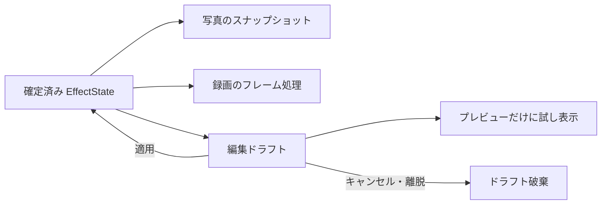

# 内部設計

## 状態の所有と更新

[EffectState](../app/src/main/java/com/bongorian/signa1/EffectState.java)が選択・チェーン・全体強度・各段のパラメータをまとめた不変の状態です。パラメータ配列はコピーして受け渡し、外部の配列操作で確定状態が変わらないようにします。

MainActivityはUIスレッドから状態を一括更新します。再描画は状態を読むだけで、選択変更や保存を行いません。GlitchEngineへはGLスレッドのキューで状態ごと渡し、複数フィールドの更新途中を描画が読むことを防ぎます。

EffectStateStoreは状態を一つの保存値として書き込みます。現在のIDは処理段階順で、保存キーは `effect_state_v2`、スキーマは `2` です。旧エフェクト設定は初期化し、保存時に旧キーを削除します。撮影設定には触れません。

## 確定状態と試し表示

EffectDialogは編集開始時の確定状態を保持し、編集セッションがまだ有効な場合だけ試し表示・適用を受け付けます。古い画面のイベントで新しい状態を上書きしません。

キャンセル、外側タップ、アプリ離脱で試し表示を解除します。録画中の編集でも、エンコーダーには適用済みの状態だけを渡します。写真は撮影時に確定状態をスナップショットし、保存ワーカーが後のUI操作に影響されないようにします。

CLEANは対象ゼロ、単体は1段だけです。非対応の段はコンテキスト切り替え時に選択から除きます。RAW原本は設定を保持しつつ全加工をバイパスします。各段の調整値を記憶することと、その段を有効にすることは別です。

## カメラとGPU

GlitchEngineがCamera2、SurfaceTexture、EGL、プレビューSurface、録画Surfaceを管理します。カメラ能力はCameraOptionsから読み取ります。構成コールバックは世代・要求番号を確認し、古い構成の応答を除外します。

EffectsがGPU向けのID定義も生成し、PhotoRendererがシェーダーのマーカーへ挿入します。JavaとGLSLのIDを別々に管理しません。

EffectChainは中間テクスチャ2枚を交互に使用します。各段が前段の結果を読み、同じ描画先を読み書きしない構成です。通常のプレビューと録画はそれぞれ中間バッファを持ちます。

- JPEG：静止画出力をPhotoRendererの専用GLコンテキストで加工し、EXIFを付けてMediaStoreへ保存。
- DNG：RAW16を必要に応じてRawGlitchで加工し、DngCreatorで保存。
- 動画：GPUからMediaRecorderの入力Surfaceへ描画。音声、分割保存、空き容量監視を含む。

## 主なファイル

| ファイル | 責務 |
|---|---|
| MainActivity | UI、確定状態の更新、編集セッション |
| EffectState / EffectStateStore | 不変状態と保存・移行 |
| EffectDialog / SignalSheet | 編集ドラフトと共通シート |
| GlitchEngine | カメラ、GLスレッド、撮影・録画 |
| EffectChain / PhotoRenderer | GPUチェーン、静止画加工 |
| RawGlitch | RAW16の破損模擬 |
| CameraOptions / CaptureSettings | 対応能力と撮影設定 |
| GeoTags / PhotoMetadata | 位置情報とメタデータ |

## 参照資料

- [Camera2 characteristics](https://developer.android.com/reference/android/hardware/camera2/CameraCharacteristics)
- [DngCreator](https://developer.android.com/reference/android/hardware/camera2/DngCreator)
- [高速撮影セッション](https://developer.android.com/reference/android/hardware/camera2/CameraConstrainedHighSpeedCaptureSession)
- [MediaRecorder](https://developer.android.com/reference/android/media/MediaRecorder)
- [LibRaw C API](https://www.libraw.org/docs/API-C.html)

## 配布と共通機能

`distribution` dimensionに `play` と `fdroid` を定義します。現在、UI・カメラ・GPU・RAW・Export・設定はすべて `src/main` にあり、flavor固有コードやSDKはありません。Play Billingなどを将来追加するときだけ `src/play` と `playImplementation` を使い、コア機能を制限しません。GitHub APKはfdroidReleaseを署名して配布します。

AppLanguageはAndroidXの標準アプリ言語APIを使い、Androidの翻訳リソースを選択します。ライセンス本文と第三者通知はビルド時に共通assetsへ同期し、アプリ内からオフラインで閲覧できます。名前付きプリセットや独立したpresetファイル形式は未実装で、直前のEffectState/CaptureSettingsをSharedPreferencesに保存します。

[RAWパイプライン](raw-pipeline.md) · [ビルド](building.md) · [署名と配布](RELEASING.md)
