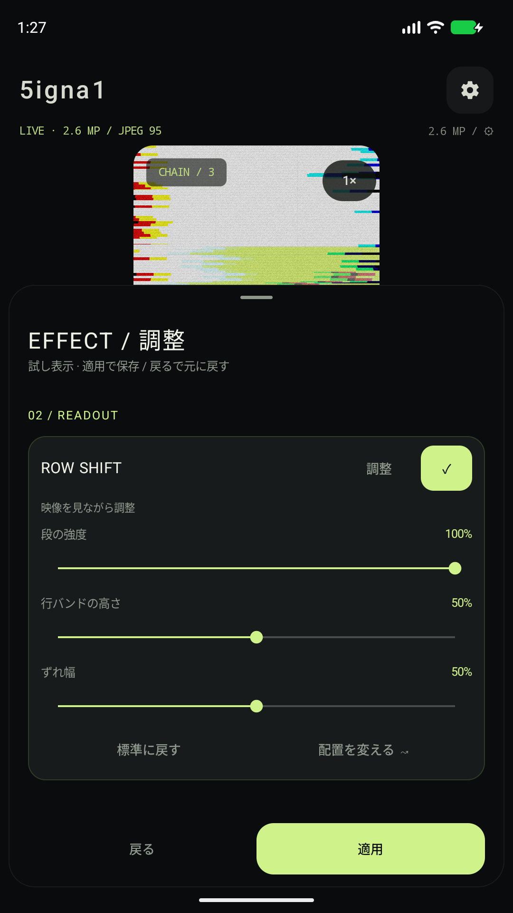

# はじめての撮影

まずは一つのエフェクトで、一枚撮ってみましょう。RAWや動画の設定は、あとから試せます。

[ガイド一覧](README.ja.md) · [インストール手順](INSTALLATION.md) · [English](GETTING_STARTED.md)

## 1. 撮影の準備

5igna1を開き、カメラの使用を許可します。「写真」モードを選び、右上の歯車から保存形式を「加工JPEG」にします。GPSはOFFのままで撮影できます。

設定の先頭にある「アプリの言語」で、日本語・English・简体中文・端末の言語を選べます。

## 2. 一つの乱れを選ぶ

「ROW SHIFT」を選び、全体強度を動かします。被写体の輪郭や縦の線を見ると、行ごとの横ずれを見つけやすくなります。

「調整」では帯の高さやずれ幅を変更できます。背景の映像で試し、気に入ったら「適用」。戻る操作や外側のタップは、変更を取り消します。

実際のアプリ画面。被写体はエミュレーターのテストパターンです。

## 3. 撮って、開く

調整画面を閉じ、中央の撮影ボタンを押します。音量キーでも撮影できます。保存後は左下のサムネイルから、端末の写真ビューアで開けます。

写真は `Pictures/5igna1` に保存されます。見つからない場合はファイルアプリからこのフォルダを確認してください。

## 4. 重ねてみる

「＋ チェーン」を開き、ROW SHIFTにCHROMAやVHSを追加します。並び順は信号処理の段階に沿って固定されています。各段を「調整」で開き、弱い強度から重ねると違いを見つけやすくなります。

単体エフェクトを選ぶとチェーンは解除されます。「CLEAN」で加工なしに戻せます。

## 覚える操作はこれだけ

| 操作 | できること |
|---|---|
| 映像をタップ | ピント合わせ |
| 左右にスワイプ | 単体エフェクトの切り替え |
| ランダムを短押し | 単体エフェクトをランダム選択 |
| ランダムを長押し | 2〜4段のチェーンをランダム選択 |
| LIVE FAULTをON | 強度・パラメータを自動変化 |
| 右下のカメラ切り替え | 前後のカメラを切り替え |

LIVE FAULTは起動時OFFです。ONにしたときの変化が終わるか、OFFにすると手動設定へ戻ります。

次は[表現のレシピ](RECIPES.ja.md)へ。保存形式を変えたくなったら[形式の選び方](FORMATS.ja.md)、操作を調べるときは[操作リファレンス](USAGE.ja.md)を使ってください。
