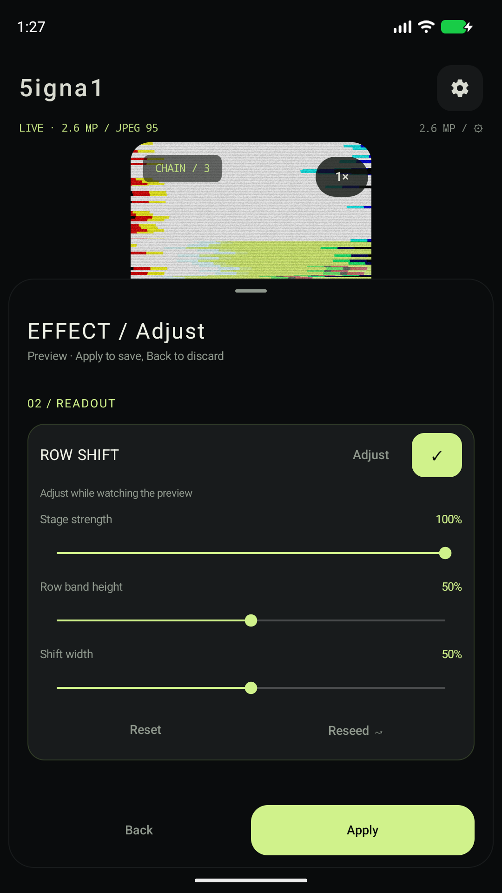

# Your first photograph

Start with one effect and one photograph. RAW and video can wait until you want to explore them.

[All guides](README.md) · [Install first](INSTALLATION.md) · [日本語](GETTING_STARTED.ja.md)

## 1. Open the camera

Allow camera access when 5igna1 asks. Select **Photo** mode, then open the gear at the top right and choose **processed JPEG**. GPS can remain off.

The first item in settings selects the app language: follow the device, Japanese, English, or Simplified Chinese.

## 2. Find a fault

Select **ROW SHIFT** and move the overall strength control. A vertical line or the outline of a subject makes the sideways displacement easier to see.

Open the adjustment screen to change the band height and displacement. The background previews your edits. Choose **Apply** to keep them. Going back or tapping outside cancels the edits.

Actual app UI, with an emulator test pattern as the subject.

## 3. Capture and open

Close the adjustment screen and press the center capture button. You can also use a volume key. After saving, tap the bottom-left thumbnail to open the image in a photo viewer.

Your photograph is in `Pictures/5igna1`. If it does not appear immediately in a gallery, check that folder in your file app.

## 4. Add another stage

Open the chain selector and add **CHROMA** or **VHS** alongside ROW SHIFT. Processing order is fixed by the imaging pipeline. Start with a low strength for each stage so you can see what it contributes.

Choosing a single effect clears the chain. **CLEAN** returns to an unprocessed view.

## A few controls to remember

| Action | Result |
|---|---|
| Tap the image | Focus |
| Swipe left or right | Change the single effect |
| Short-press Random | Choose one random effect |
| Long-press Random | Choose a random chain of 2–4 effects |
| Turn LIVE FAULT on | Vary strength and parameters over time |
| Tap the bottom-right camera control | Switch front/back camera |

LIVE FAULT starts off when the app launches. When a change ends, or you turn it off, processing returns to your manual settings.

Try a [creative recipe](RECIPES.md) next. For file choices, read [Choosing a format](FORMATS.md); for the rest of the controls, use the [reference](USAGE.md).
