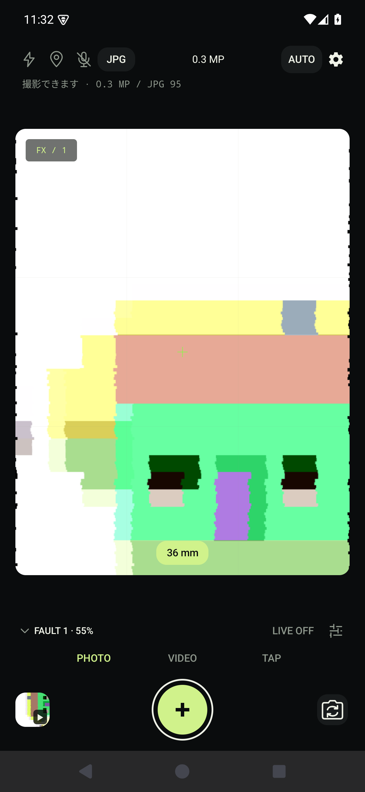
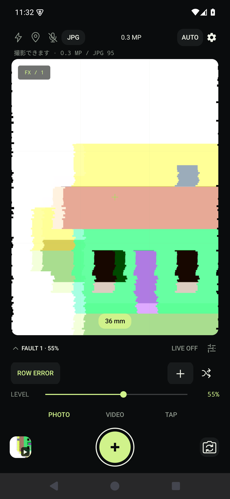
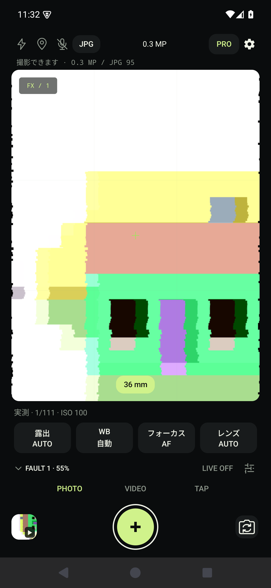
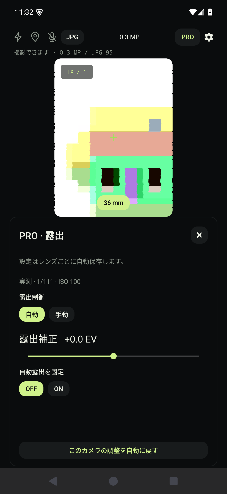
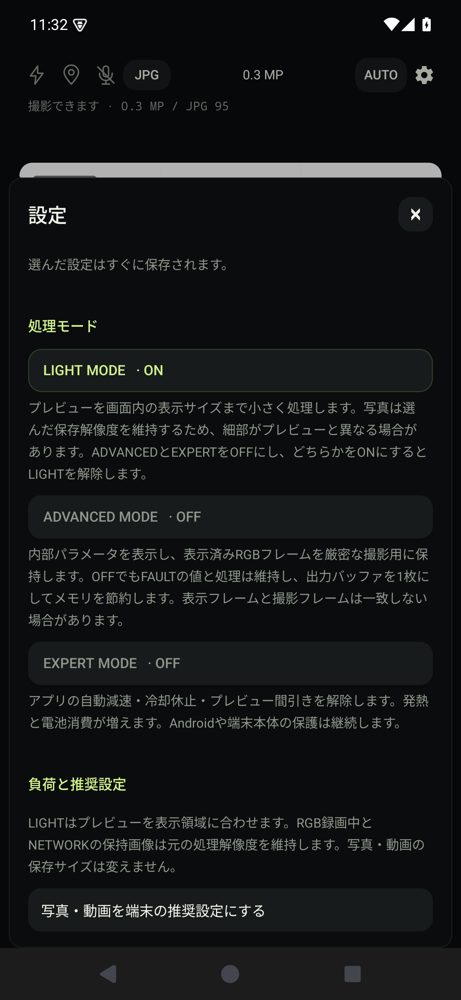
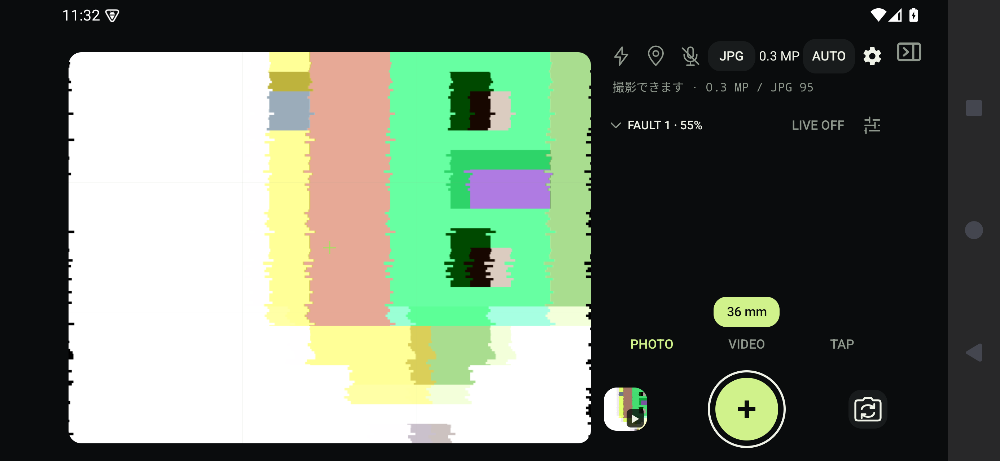
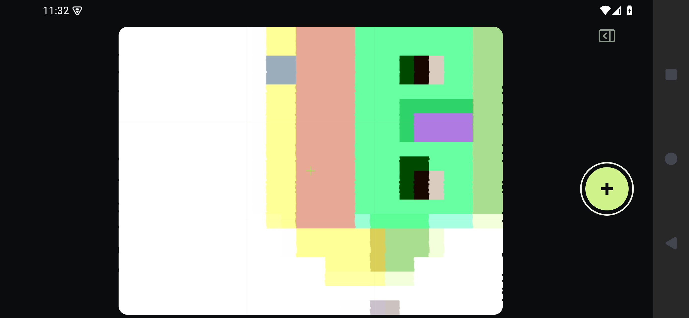
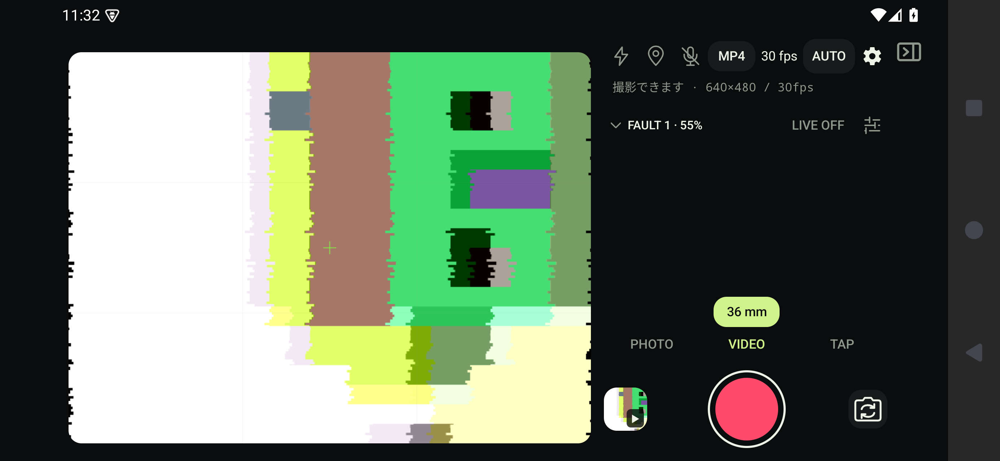
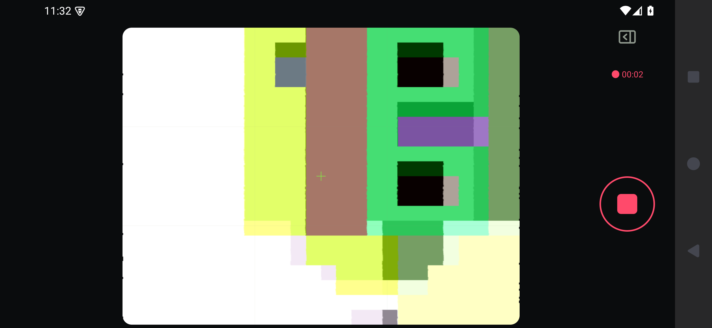

# PRO撮影画面：画像付きレビュー

[English](UI_REVIEW.md) · [PRO操作](PRO_CAMERA.ja.md) · [オリジナル画像の台帳](ui-review/manifest.json)

2026-09-12に確認した**未リリースの開発UI**です。専用エミュレーター `Signal_Review_1280_480` は、接続端末25060RK16Cと同じ **1280×2772ピクセル・実効480dpi** に設定しました。3ボタンナビゲーションを有効にし、下端・右端のシステム操作領域も含めて確認しています。エミュレーターはAPI 35、実機はAPI 36で、メーカーのシステムUIは異なります。カメラのテストパターン・対応レンズ・性能は実機を再現しません。

## 画像で確認して直した点

- 「撮影できます」と保存解像度・品質の概況を、横1行の上部ツールバー直下へ移動。プレビューには重ねません。
- FAULTは先頭の山形アイコン、操作領域は外側のパネルアイコンで開閉。開く／閉じるの文字は表示せず、読み上げには意味を残します。
- PHOTO／VIDEO／TAPは文字タブ。対応するPROの4項目は右端を欠かずに収めます。
- 横画面の焦点距離をプレビュー外で中央配置。操作部を開いても収納しても同じ80dpシャッターを使います。
- 収納中の録画時間をシャッター上部に残し、MP4表示の途中改行を解消しました。

## 縦画面

| AUTO | FAULT展開 | PRO |
|---|---|---|
|  |  |  |

| PRO露出調整 | 設定 |
|---|---|
|  |  |

## 横画面

操作部を開いた状態：

収納した状態：

動画の準備状態：

収納したまま録画中：

## 検証と再現

日本語・英語の `workspace-review` が両方成功しました。各9枚の画像を取得し、80dpシャッターが欠けないこと、収納・録画中も同じ撮影Viewであること、録画開始・停止、上部の状態行、PRO項目の幅、保存形式の1行表示、収納時の録画時計を検査しています。18枚のPNGは無加工・元解像度です。[台帳](ui-review/manifest.json)に画像サイズ・ハッシュ・アプリソースのダイジェストを記録しています。75件の単体テスト、ビルド、lintに加えた検証であり、すべてのメーカーUIや文字拡大率で同じ表示になるという意味ではありません。

エミュレーターは `python3 tools/review-emulator.py` で再作成でき、起動コマンドが表示されます。[英語版の実行手順](UI_REVIEW.md#verification-and-reproduction)でビルド・検証・画像収集まで再現できます。必要なシステムイメージは `system-images;android-35;google_apis;arm64-v8a` です。既存の専用AVDはデータを保持して再利用します。検証用の短い動画はエミュレーター内だけに保存し、USB実機を自動操作しません。

## 画像の出典

プロジェクトのApache-2.0 UIと、AOSPエミュレーターが生成する家のテストパターンを撮影したものです。ROW ERRORはアプリ自身が適用しています。Apache-2.0のテストパターンの帰属は[素材監査](audit/ASSETS.md)と[NOTICE](../NOTICE)に記録しています。私的な実写素材、UI合成、広告用生成画像、レタッチは含みません。システムUIはAndroidシステムイメージのものです。公開済みリリース・ストアの画像とは分けて保存しています。
