# PRO workspace: visual review


These images record the 2026-09-12 review. The current development build moves the top AUTO/PRO switch to Settings → Modes → PRO shooting mode.

[日本語](UI_REVIEW.ja.md) · [PRO controls](PRO_CAMERA.md) · [Original image manifest](ui-review/manifest.json)

This is an **unreleased development UI**, reviewed on 2026-09-12. The dedicated `Signal_Review_1280_480` emulator matches the connected 25060RK16C's **1280×2772 pixels and effective 480 dpi**. Three-button system navigation is enabled to include the bottom/right navigation inset. The emulator runs API 35; the physical device runs API 36 and a different system skin. Its camera pattern, sensor options and performance do not reproduce the physical camera.

## Changes confirmed in the images

- Readiness and output/quality information sit below the single top toolbar, outside the preview.
- FAULT uses a leading chevron. The outer panel icon indicates landscape collapse/expand without visible Open/Close words; accessible labels retain their meaning.
- PHOTO / VIDEO / TAP are text tabs. All four supported PRO entries fit without cutting the final card off.
- Landscape focal choices are centered outside the preview. The same 80 dp shutter is used with controls open or collapsed.
- Recording time remains above the shutter in the collapsed rail. MP4 stays on one line.

## Portrait

| AUTO | FAULT expanded | PRO |
|---|---|---|
| 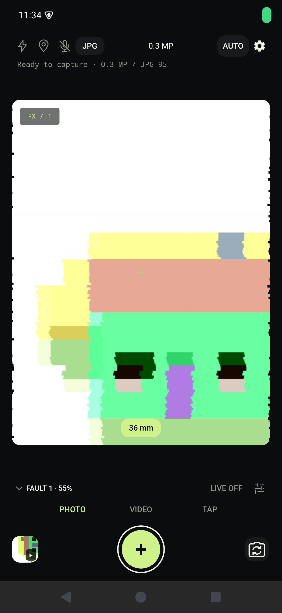 | 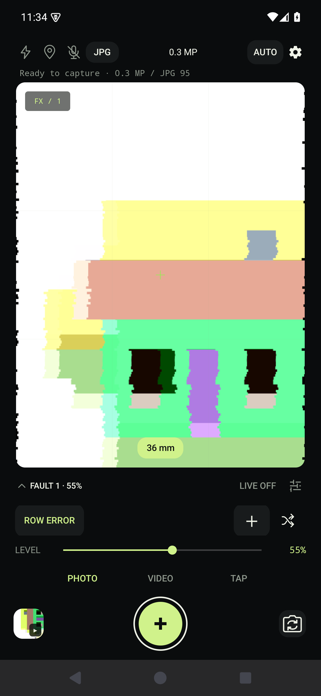 | 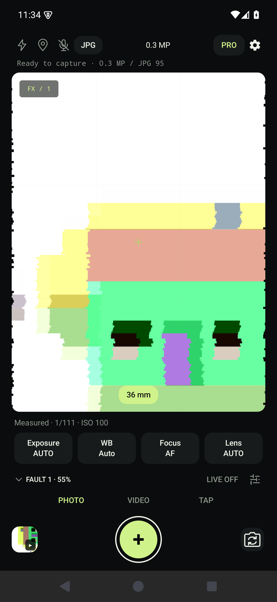 |

| PRO exposure | Settings |
|---|---|
| 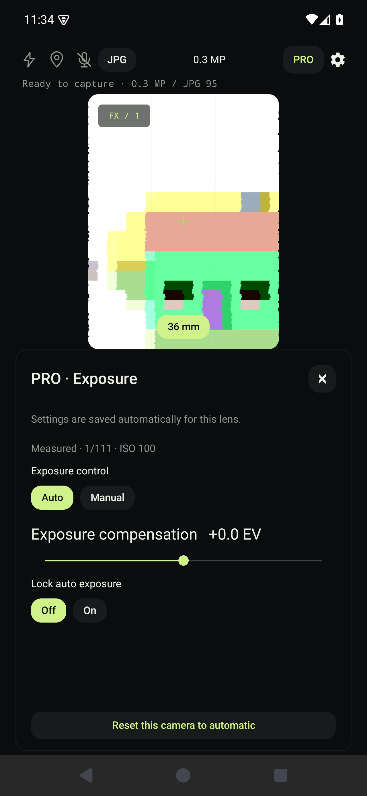 | 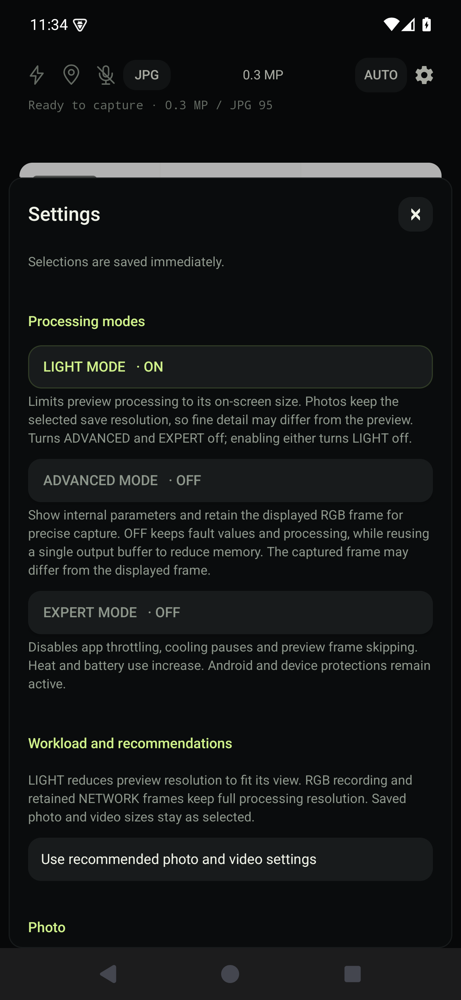 |

## Landscape

Controls open:

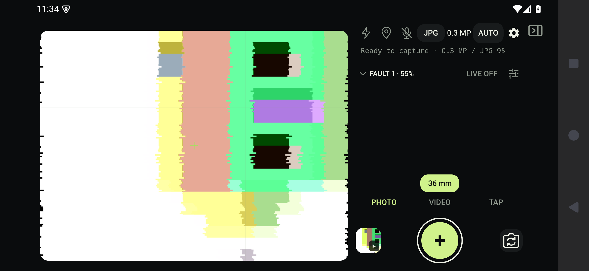

Controls collapsed:

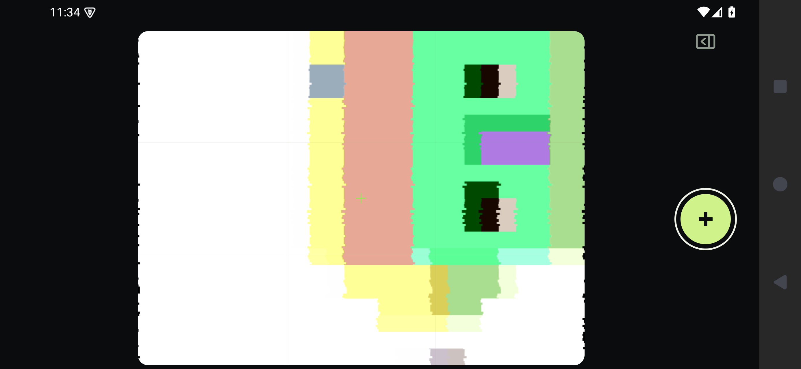

Video ready:

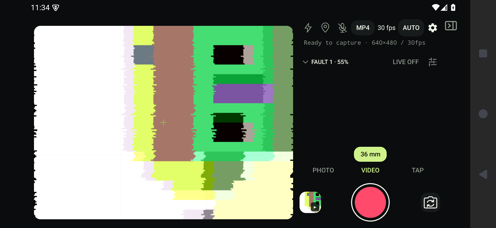

Recording with controls collapsed:

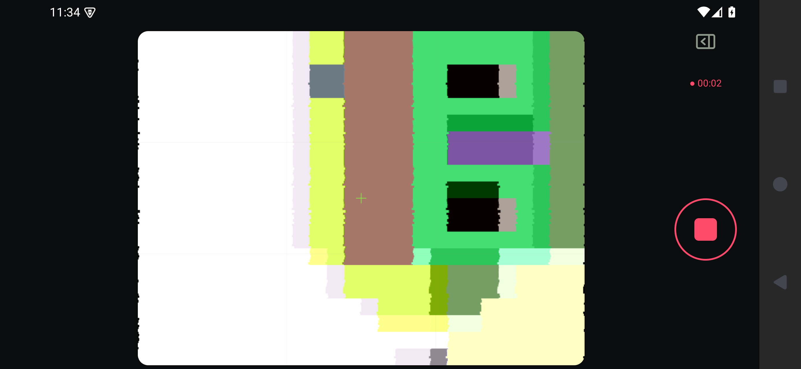

## Verification and reproduction

Both Japanese and English `workspace-review` runs passed. They generate nine screenshots each and check: an unclipped 80 dp shutter, capture-view identity through collapse and recording, recording start/stop, top status placement, PRO entry widths, a single-line format label and the collapsed recording clock. The 18 PNGs are original full-resolution screen captures; [the manifest](ui-review/manifest.json) records dimensions, hashes and the app-source digest. This complements the 75 unit tests, debug builds and lint; it is not a claim of identical rendering on every Android skin or font scale.

From the repository root, with a supported JDK and Android SDK available:

```sh
python3 tools/review-emulator.py
# Run the emulator command printed by the script, then wait for Android to boot.
adb -s emulator-5554 shell cmd overlay enable-exclusive --category com.android.internal.systemui.navbar.threebutton
./tools/build.sh assembleFdroidDebug assembleFdroidDebugAndroidTest
adb -s emulator-5554 install -r app/build/outputs/apk/fdroid/debug/app-fdroid-debug.apk
adb -s emulator-5554 install -r app/build/outputs/apk/androidTest/fdroid/debug/app-fdroid-debug-androidTest.apk
adb -s emulator-5554 shell pm grant com.bongorian.signa1.debug android.permission.CAMERA
adb -s emulator-5554 shell am instrument -w -e action workspace-review -e language ja com.bongorian.signa1.debug.test/com.bongorian.signa1.DeviceChecks
adb -s emulator-5554 shell am instrument -w -e action workspace-review -e language en com.bongorian.signa1.debug.test/com.bongorian.signa1.DeviceChecks
python3 tools/collect-workspace-review.py --serial emulator-5554
```

The system image is `system-images;android-35;google_apis;arm64-v8a`. The script reuses the dedicated AVD and preserves its data. The review records a short emulator video to check start/stop; it does not operate the USB phone. Choose a different emulator serial in the commands when necessary.

## Image provenance

These are captures of the project's Apache-2.0 UI over the AOSP emulator's generated house pattern, with ROW ERROR applied by the app. Source attribution for that Apache-2.0 pattern is recorded in [the asset audit](audit/ASSETS.md) and [NOTICE](../NOTICE). There is no private camera imagery, composited interface, generated promotional artwork or retouching. System UI belongs to the Android system image. These review images do not replace the published release/store screenshots.

## Additional chain editor review

Chain cards use a consistent 4 dp radius. Actions use 40 dp targets with 20 dp icons. Close, shuffle and apply have separate positions; the sliders icon opens each stage’s description and controls. The workspace collapse action is hidden behind the editor in landscape.

| Chain | Selection | Adjustment |
|---|---|---|
| 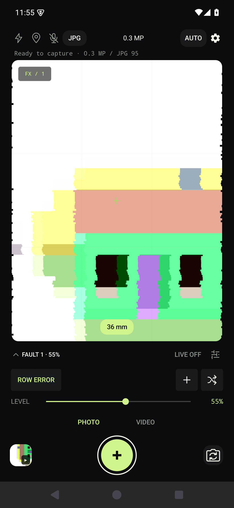 | 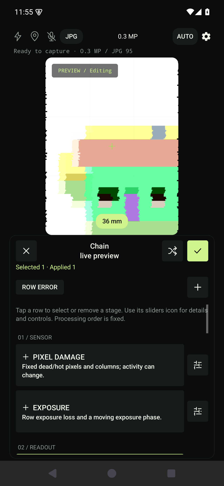 | 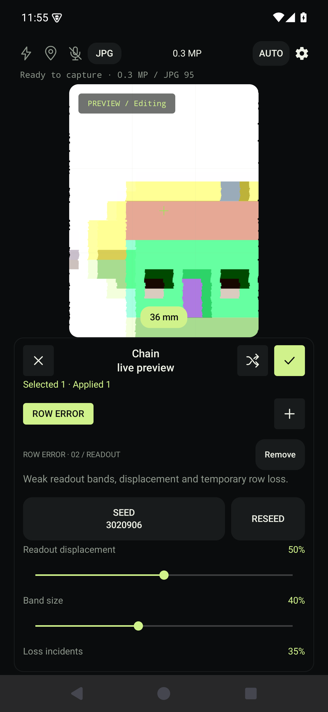 |

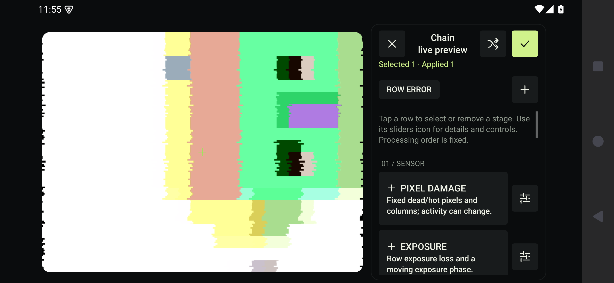

Twelve Japanese/English portrait/landscape captures cover icon clipping/overlap, hidden underlying controls, and cancel/apply behavior. See the [manifest](chain-review/manifest.json). After building and installing as above, reproduce with:

```sh
adb -s emulator-5554 shell am instrument -w -e action chain-review -e language ja com.bongorian.signa1.debug.test/com.bongorian.signa1.DeviceChecks
adb -s emulator-5554 shell am instrument -w -e action chain-review -e language en com.bongorian.signa1.debug.test/com.bongorian.signa1.DeviceChecks
python3 tools/collect-workspace-review.py --suite chain
```
