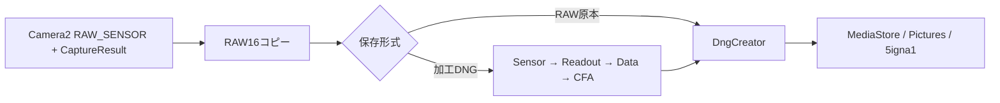

# RAWパイプライン

Camera2のRAW_SENSOR入力を処理する経路と、OpenGL ES上でRAW風の故障を模す経路は別です。実装の正本は[RawGlitch](../app/src/main/java/com/bongorian/signa1/RawGlitch.java)、[GlitchEngine](../app/src/main/java/com/bongorian/signa1/GlitchEngine.java)、[RawVideoRecorder](../app/src/main/java/com/bongorian/signa1/RawVideoRecorder.java)です。

## 静止画

RAW16は1サンプル2バイトのリトルエンディアンとして読み書きします。撮影時点の確定済みチェーン・強度・各段パラメータ・LIVE値を使い、保存中のUI変更が画像へ混ざることを防ぎます。DngCreatorへカメラ特性と対応するCaptureResultを渡し、向き・任意の位置情報・処理説明を記録します。

`Effects.raw()` はID 1〜8だけを許可します。センサーSENSOR FAIL / EXPOSURE BAND、読み出しROW SHIFT / LINE LOSS、データBIT ROT / DATA SHIFT、配列CFA TEAR / CFA OFFSETの順です。RAW原本は画素加工をバイパスします。

## Bayer位相とデータ故障

- **ROW SHIFT** は偶数画素単位の水平移動でBayer位相を保持し、欠落端を黒レベルで埋めます。
- **LINE LOSS** は直前の2行を交互に反復して行位相を保持し、先頭側の欠落を黒レベルで埋めます。
- **DATA SHIFT** は0〜31バイトのずれを与えて16bitサンプルとして再解釈します。奇数バイトではワード境界が変わります。DNGコンテナのヘッダーを壊す機能ではありません。
- **CFA TEAR / CFA OFFSET** は意図的にサンプル位相を変えます。OFFSETは2×2セル内で横・縦・両方向に置換し、CFAメタデータを元のまま保存して誤った色解釈を作ります。
- 加工値は0〜白レベルへ制限します。現在の黒埋め値は `SENSOR_BLACK_LEVEL_PATTERN` の(0,0)から得るスカラーで、色チャンネル別の黒レベル補正を行うRAW現像器ではありません。

強度ゼロでの保持、行位相、奇数寸法、バイトずれ、白レベル上限は[PipelineCheck](../tools/PipelineCheck.java)と[EffectStateCheck](../tools/EffectStateCheck.java)で検証します。

## プレビューとの違い

プレビュー・JPEG・MP4はCamera2から得た処理済みRGBを[GLSL](../app/src/main/res/raw/effect.glsl)で加工します。CFA系効果はRGBから合成したRGGBモザイク上の近似です。DEMOSAICはそのモザイクに不整合な補間を行う意匠で、実センサーRAWのライブ現像ではありません。GPU座標・色処理とRAWのセンサー座標・現像ソフトの解釈が異なるため、同じ設定でも完全一致しません。

## RAW動画

通常モードのRAW_SENSORとプレビューを同時出力し、センサー時刻でRAW画像とCaptureResultを対応付けます。実際にDNGを書き出せるか事前に確認し、失敗したカメラでは通常動画へ戻します。保存待ちは最大2フレーム、コピーは1フレーム64MiB以下です。

ZIPには原本DNG、`timestamps.csv`、`manifest.json` を保存します。音声・エフェクト・LIVE加工は適用しません。停止・バックグラウンド移行時に保存待ちを処理してZIPを確定し、約3.5GBで分割します。大容量・熱・欠落・目標fpsの制限は[RAW_VIDEO.md](RAW_VIDEO.md)を参照してください。

Play / F-Droid間でRAWの処理、対応判定、制限は同じソースを使います。LibRaw、FFmpeg、MotionCamのコードをAPKに組み込んでいません。
